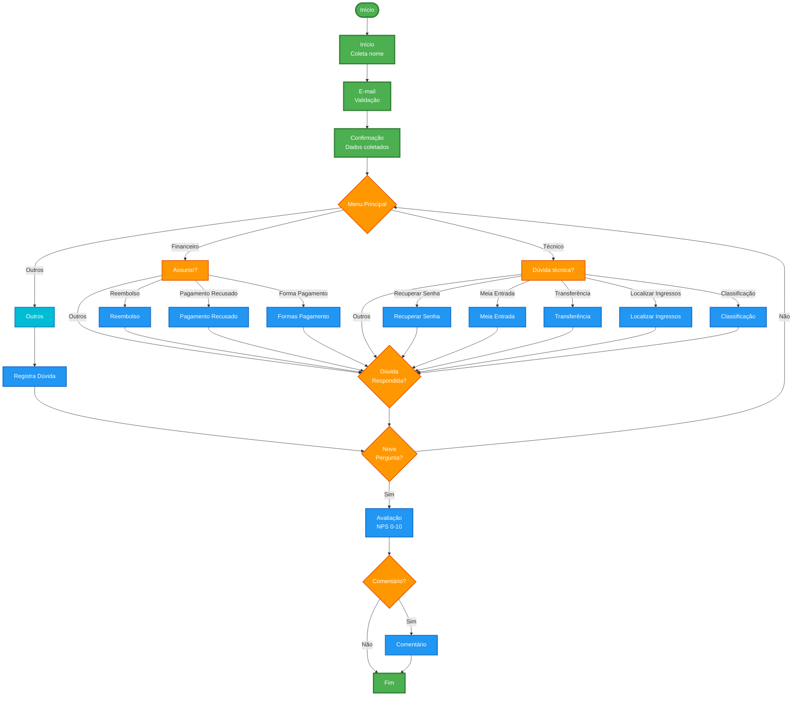

# Fluxograma - Chatbot iPass - Canal de Atendimento

## Descrição dos Fluxos

### 1. Fluxo Inicial
- **Início**: Saudação e coleta do nome do usuário
- **Email**: Validação do e-mail (formato obrigatório)
- **Tudo Certo**: Confirmação dos dados coletados

### 2. Menu Principal
O usuário escolhe entre três opções:
- **Suporte Financeiro**: Questões sobre pagamentos, reembolsos e formas de pagamento
- **Suporte Técnico**: Dúvidas sobre senha, ingressos, transferências, etc.
- **Outros**: Para dúvidas não categorizadas

### 3. Suporte Financeiro
- Reembolso/Cancelamento
- Pagamento Recusado
- Formas de Pagamento (Cartão de Crédito e PIX)

### 4. Suporte Técnico
- Recuperação de senha
- Meia Entrada
- Transferência de titularidade
- Onde encontro meus ingressos
- Classificação Indicativa

### 5. Fluxo de Avaliação
Após responder a dúvida:
- Pergunta se a dúvida foi respondida
- Se sim, solicita avaliação NPS (0-10)
- Opcionalmente coleta comentário
- Encerra a conversa

### 6. Fluxo de Outros
- Registra a dúvida
- Orienta contato via e-mail: contato@ipass.com.br
- Retorna ao menu para nova tentativa

## Legenda de Cores

- **🟢 Verde**: Início e fim do fluxo
- **🔵 Azul**: Processos de informação/resposta
- **🟠 Laranja**: Pontos de decisão e menus
- **🔷 Azul claro**: Fluxos de suporte técnico

